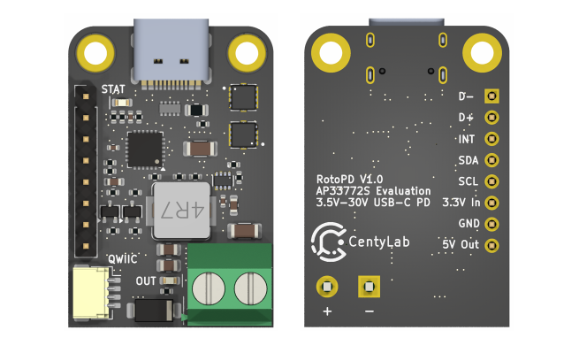

## Arduino-AP33772S

This is CentyLab AP33772S USB-C PD 3.1 Sink Controller for Arduino.

AP33772S is a USB PD3.1 Sink controller that communicate via I2C, an upgrade from the previous version AP33772. With this library, can you use the IC with any Arduino compatable board 32bits as it is based on the Wire.h library. This library currently **does not support 16 bits micro-controller like UNO** and does not support interrupt driven behavior.

Tested and work great with [RotoPD evaluation board](https://hackaday.io/project/201953-rotopd-usb-c-pd-31-breakout-i2c) as well as  [PicoPD Pro](https://hackaday.io/project/198384-picopd-pro-usb-c-pd-31-pps-avs-with-rp2040) from [CentyLab](https://hackaday.io/centylab)

## Features

+ Standard fixed voltage request
+ PPS voltage/current request
+ AVS voltage request
+ Voltage reading
+ Current reading
+ NTC temperature reading
+ Output back-to-back NMOS control
+ Set/read different safety values

## Tested boards
+ Sparkfun Pro Micro - ESP32-C3
+ Adafruit Qt Py - ESP32-C3
+ Raspberry Pi RP2040
+ STM32-F411RE
+ STM32-G070RB

The library is expected to work in all 32-bits micro-controller. The code **doesn't work on 16-bits microcontroller** as some variables will be overflow.

## Dependencies
+ [Arduino-timer](https://github.com/contrem/arduino-timer)

## Example AVSCycle.ino
